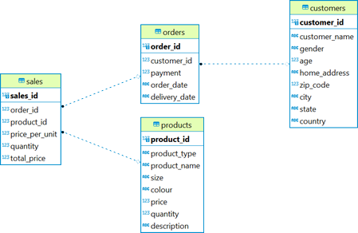
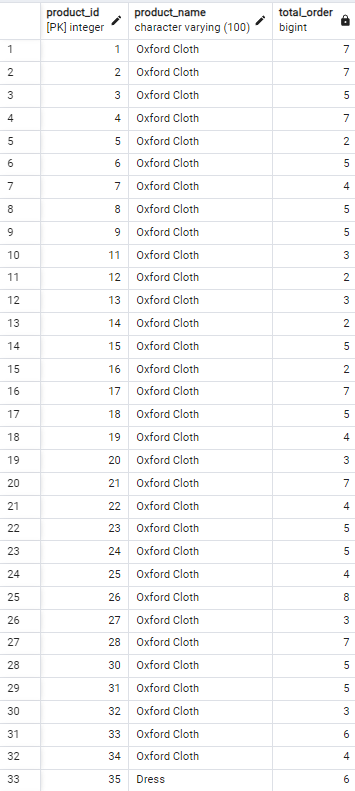
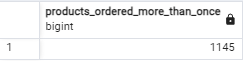
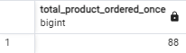
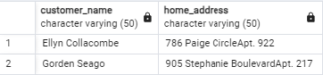
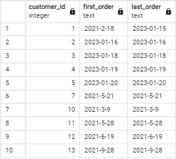
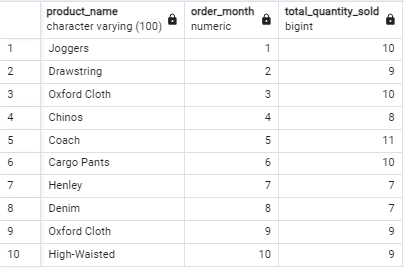

# Online Shopping Store Analysis

This repository contains SQL queries and analysis for understanding transactional data of an online shopping platform. The queries address specific business questions and provide actionable insights for management, marketing, and operations teams. Screenshots of query results are included for easy reference.

- **ERD Diagram**


## Repository Structure

Each task is organized into a separate section with:
- The SQL query
- A description of the task and results
- A screenshot of the query result, saved in the `Image/` folder of this repository

### Tasks

1. **Products Ordered More Than Once**  
   Identify the product IDs and product names that have been ordered more than once.

   - **SQL Query**:
     ```sql
     SELECT
         p.product_id,
         p.product_name,
         COUNT(s.order_id) AS total_orders
     FROM
         products p
         JOIN sales s USING (product_id)
     GROUP BY
         p.product_id, p.product_name
     HAVING
         COUNT(s.order_id) > 1
     ORDER BY
         p.product_id;
     ```
   - **Screenshot**:  
     

2. **Products Ordered Only Once**  
   Count the number of products that have been ordered only once.

   - **SQL Query**:
     ```sql
     SELECT
         COUNT(product_id) AS products_ordered_once
     FROM (
         SELECT
             p.product_id,
             COUNT(s.order_id) AS total_orders
         FROM
             products p
             JOIN sales s USING (product_id)
         GROUP BY
             p.product_id
         HAVING
             COUNT(s.order_id) = 1
     ) AS single_order_products;
     ```
   - **Screenshot**:  
     

3. **Customer Behavior - Repeat Orders**  
   List customers who have placed orders more than twice in a single month, along with their names and addresses.

   - **SQL Query**:
     ```sql
     WITH repeat_customers AS (
         SELECT
             customer_id,
             EXTRACT(MONTH FROM order_date) AS order_month,
             COUNT(order_id) AS total_orders
         FROM
             orders
         GROUP BY
             customer_id, order_month
         HAVING
             COUNT(order_id) > 2
     )
     SELECT
         c.customer_name,
         c.home_address
     FROM
         repeat_customers rc
         JOIN customers c USING (customer_id)
     ORDER BY
         c.customer_name;
     ```
   - **Screenshot**:  
     

4. **First and Last Order Date for Customers**  
   Find the first and last order date for each customer and show the first 10 records sorted by customer ID.

   - **SQL Query**:
     ```sql
     SELECT
         customer_id,
         MIN(order_date) AS first_order,
         MAX(order_date) AS last_order
     FROM
         orders
     GROUP BY
         customer_id
     ORDER BY
         customer_id
     LIMIT 10;
     ```
   - **Screenshot**:  
     

5. **Top Customers in "Trousers" Category**  
   Retrieve the top 5 customers who spent the most on "Trousers," along with the total amount spent and quantity sold.

   - **SQL Query**:
     ```sql
     WITH top_trousers_customers AS (
         SELECT
             c.customer_name,
             SUM(s.quantity * s.total_price) AS total_spent,
             SUM(s.quantity) AS quantity_sold
         FROM
             customers c
             JOIN orders o USING (customer_id)
             JOIN sales s USING (order_id)
             JOIN products p USING (product_id)
         WHERE
             p.product_type = 'Trousers'
         GROUP BY
             c.customer_name
         ORDER BY
             total_spent DESC
         LIMIT 5
     )
     SELECT
         *
     FROM
         top_trousers_customers;
     ```
   - **Screenshot**:  
     

6. **Top-Selling Product for Each Month**  
   Identify the top-selling product for each month based on total quantity sold. If quantities are tied, the smallest product ID is selected.

   - **SQL Query**:
     ```sql
     WITH monthly_top_product AS (
         SELECT
             EXTRACT(MONTH FROM o.order_date) AS order_month,
             p.product_id,
             SUM(s.quantity) AS total_quantity,
             ROW_NUMBER() OVER (
                 PARTITION BY EXTRACT(MONTH FROM o.order_date)
                 ORDER BY SUM(s.quantity) DESC, p.product_id
             ) AS rank
         FROM
             orders o
             JOIN sales s USING (order_id)
             JOIN products p USING (product_id)
         GROUP BY
             order_month, p.product_id
     )
     SELECT
         p.product_name,
         mtp.order_month,
         mtp.total_quantity
     FROM
         monthly_top_product mtp
         JOIN products p USING (product_id)
     WHERE
         rank = 1
     ORDER BY
         order_month;
     ```
   - **Screenshot**:  
     

7. **Warehouse Optimization**  
   Calculate the minimum warehouse size required to store 20 containers for both prime and non-prime items.

   - **SQL Query**:
     ```sql
     WITH container_size AS (
         SELECT
             CASE WHEN is_prime = 'true' THEN 'prime' ELSE 'non-prime' END AS item_type,
             SUM(item_size_sqft) AS total_size
         FROM
             item
         GROUP BY
             item_type
     )
     SELECT
         SUM(total_size * 20) AS minimum_warehouse_size
     FROM
         container_size;
     ```
   - **Screenshot**:  
     

## How to Use

1. Load the provided SQL queries into a PostgreSQL database with the provided dataset.
2. Execute the queries to replicate the analysis.
3. Check the `Image/` folder for screenshots of query results for reference.

---

## Requirements

- PostgreSQL database
- Dataset including tables like `products`, `customers`, `orders`, `sales`, and `item`.

---

## Acknowledgments

- Dataset provided as part of the SQL & Relational Database mentoring program by Pacmann AI.
