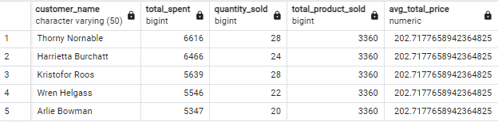
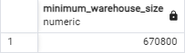

# Online Shopping Store Analysis

This repository contains SQL queries and analysis for understanding transactional data of an online shopping platform. The queries address specific business questions and provide actionable insights for management, marketing, and operations teams. Screenshots of query results are included for easy reference.

- **ERD Diagram**


## Repository Structure

Each task is organized into a separate section with:
- The SQL query
- A description of the task and results
- A screenshot of the query result, saved in the `Image/` folder of this repository

### Tasks

1. **Products Ordered More Than Once**  
   Identify the product IDs and product names that have been ordered more than once.

   - **SQL Query**:
     ```sql
     CREATE TEMPORARY TABLE product_ordered_1 AS (
         SELECT 
             p.product_id,
             p.product_name,
             COUNT(s.order_id) AS total_order
         FROM
             products p
             LEFT JOIN sales s USING(product_id)
         GROUP BY
             p.product_id, p.product_name
         HAVING
             COUNT(s.order_id) > 1
         ORDER BY
             p.product_id
     );
     ```
   - **Screenshot**:  
     

2. **Number of Products Ordered More Than Once**  
   Count the number of products that have been ordered more than once.

   - **SQL Query**:
     ```sql
     SELECT 
         COUNT(DISTINCT product_id) AS products_ordered_more_than_once 
     FROM 
         product_ordered_1;
     ```
   - **Screenshot**:  
     

3. **Products Ordered Only Once**  
   Count the number of products that have been ordered only once.

   - **SQL Query**:
     ```sql
     WITH product_ordered AS (
         SELECT 
             p.product_id,
             p.product_name,
             COUNT(s.order_id) AS total_order
         FROM
             products p
             LEFT JOIN sales s USING(product_id)
         GROUP BY
             p.product_id, p.product_name
     )
     SELECT
         COUNT(DISTINCT product_id) AS total_product_ordered_once
     FROM 
         product_ordered
     WHERE
         total_order = 1;
     ```
   - **Screenshot**:  
     

4. **Repeat Customers**  
   List customers who have placed orders more than twice in a single month, along with their names and addresses.

   - **SQL Query**:
     ```sql
     WITH special_customer AS (
         SELECT
             customer_id,
             EXTRACT(MONTH FROM order_date::date) AS order_month,
             EXTRACT(YEAR FROM order_date::date) AS order_year,
             COUNT(order_id) AS total_orders
         FROM 
             orders
         GROUP BY
             customer_id, EXTRACT(MONTH FROM order_date), EXTRACT(YEAR FROM order_date)
         HAVING
             COUNT(order_id) > 2
     )
     SELECT
         c.customer_name,
         c.home_address
     FROM 
         special_customer sc
         JOIN customers c USING (customer_id)
     ORDER BY
         c.customer_name;
     ```
   - **Screenshot**:  
     

5. **First and Last Order Dates**  
   Find the first and last order dates for each customer and display the first 10 records sorted by customer ID.

   - **SQL Query**:
     ```sql
     SELECT
         customer_id,
         MIN(order_date) AS first_order,
         MAX(order_date) AS last_order
     FROM 
         orders
     GROUP BY
         customer_id
     ORDER BY
         customer_id
     LIMIT 10;
     ```
   - **Screenshot**:  
     

6. **Top Customers in "Trousers" Category**  
   Retrieve the top 5 customers who spent the most on "Trousers," along with the total amount spent and quantity sold.

   - **SQL Query**:
     ```sql
     WITH top_5_trouser AS (
         SELECT
             c.customer_name,
             SUM(s.quantity * s.total_price) AS total_spent,
             SUM(s.quantity) AS quantity_sold
         FROM
             customers c
             JOIN orders o USING(customer_id)
             JOIN sales s USING(order_id)
             JOIN products p USING(product_id)
         WHERE
             p.product_type = 'Trousers'
         GROUP BY
             c.customer_name
         ORDER BY
             total_spent DESC
         LIMIT 5
     ), 
     total_avg AS (
         SELECT
             SUM(s.quantity) AS total_product_sold,
             AVG(s.total_price) AS avg_total_price
         FROM
             sales s
             JOIN products p USING(product_id)
         WHERE
             p.product_type = 'Trousers'
     )
     SELECT
         t.customer_name,
         t.total_spent,
         t.quantity_sold,
         ta.total_product_sold,
         ta.avg_total_price
     FROM
         top_5_trouser t
         CROSS JOIN total_avg ta
     ORDER BY
         t.total_spent DESC;
     ```
   - **Screenshot**:  
     

7. **Top-Selling Products by Month**  
   Identify the top-selling product for each month based on total quantity sold.

   - **SQL Query**:
     ```sql
     WITH product_quantity_month AS (
         SELECT
             EXTRACT(MONTH FROM o.order_date::date) AS order_month,
             p.product_id,
             SUM(s.quantity) AS total_quantity_sold,
             ROW_NUMBER() OVER (
                 PARTITION BY EXTRACT(MONTH FROM o.order_date::date)
                 ORDER BY SUM(s.quantity) DESC, p.product_id
             ) AS row_num
         FROM
             orders o
             JOIN sales s USING(order_id)
             JOIN products p USING(product_id)
         GROUP BY
             order_month, p.product_id
     )
     SELECT
         p.product_name,
         pqm.order_month,
         pqm.total_quantity_sold
     FROM
         product_quantity_month pqm
         JOIN products p USING(product_id)
     WHERE
         pqm.row_num = 1
     ORDER BY
         pqm.order_month;
     ```
   - **Screenshot**:  
     

8. **Monthly Total Payment**  
   Create a view to calculate the total payment received each month.

   - **SQL Query**:
     ```sql
     CREATE VIEW monthly_payment AS
     SELECT
         EXTRACT(MONTH FROM order_date::date) AS order_month,
         SUM(payment) AS total_payment
     FROM
         orders
     GROUP BY
         1
     ORDER BY
         1;
     SELECT * FROM monthly_payment;
     ```
   - **Screenshot**:  
     

9. **Warehouse Optimization - Maximum Storage**  
   Calculate the maximum number of prime and non-prime items that can be stored in a warehouse of 600,000 sq ft.

   - **SQL Query**:
     ```sql
     WITH container_size_by_type AS (
         SELECT
             CASE WHEN is_prime = 'true' THEN 'prime' ELSE 'non-prime' END AS item_type,
             SUM(item_size_sqft) AS total_size_sqft
         FROM
             item
         GROUP BY
             item_type
     ),
     prime_container_count AS (
         SELECT
             total_size_sqft AS prime_total_size_sqft,
             FLOOR(600000 / total_size_sqft) AS prime_max_containers
         FROM
             container_size_by_type
         WHERE
             item_type = 'prime'
     ),
     remaining_area AS (
         SELECT
             600000 - (prime_max_containers * prime_total_size_sqft) AS remaining_area
         FROM
             prime_container_count
     ),
     non_prime_container_count AS (
         SELECT
             total_size_sqft AS non_prime_total_size_sqft,
             CASE WHEN remaining_area > 0 THEN FLOOR(remaining_area / total_size_sqft) ELSE 1 END AS non_prime_max_containers
         FROM
             container_size_by_type, remaining_area
         WHERE
             item_type = 'non-prime'
     ),
     item_count AS (
         SELECT
             'prime' AS item_type,
             prime_max_containers AS total_containers,
             prime_max_containers * 35 AS total_items
         FROM
             prime_container_count
         UNION ALL
         SELECT
             'non-prime' AS item_type,
             non_prime_max_containers AS total_containers,
             non_prime_max_containers * 15 AS total_items
         FROM
             non_prime_container_count
     )
     SELECT
         item_type,
         total_containers,
         total_items
     FROM
         item_count;
     ```
   - **Screenshot**:  
     

10. **Minimum Warehouse Size**  
    Determine the minimum required size of a new warehouse to store 20 containers each for prime and non-prime items.

    - **SQL Query**:
      ```sql
      WITH container_size_by_type AS (
          SELECT
              CASE WHEN is_prime = 'true' THEN 'prime' ELSE 'non-prime' END AS item_type,
              SUM(item_size_sqft) AS total_size_sqft_per_item
          FROM
              item
          GROUP BY
              1
      ), 
      container_requirements AS (
          SELECT
              item_type,
              total_size_sqft_per_item * 20 AS total_area_required
          FROM
              container_size_by_type
      )
      SELECT
          SUM(total_area_required) AS minimum_warehouse_size
      FROM
          container_requirements;
      ```
    - **Screenshot**:  
      

## How to Use

1. Load the provided SQL queries into a PostgreSQL database with the provided dataset.
2. Execute the queries to replicate the analysis.
3. Check the `Image/` folder for screenshots of query results for reference.

---

## Requirements

- PostgreSQL database
- Dataset including tables like `products`, `customers`, `orders`, `sales`, and `item`.

---

## Acknowledgments

- Dataset provided as part of the SQL & Relational Database mentoring program by Pacmann AI.
